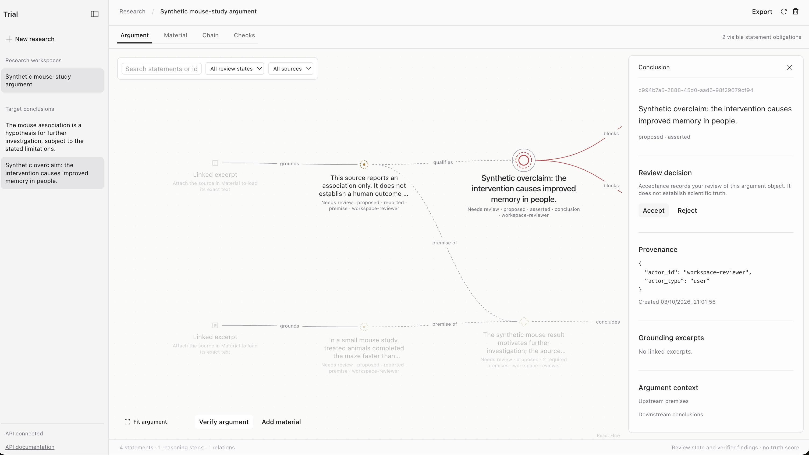

Turn papers and notes into an argument graph you can inspect. Follow claims back to their source, review the reasoning, and find gaps in the evidence.

## Run it

With Docker running:

```sh
cp .env.example .env
make up
```

Open [localhost](http://localhost). Choose **Try a demo** to get started without an API key.

Use the mode switch in the chat box: **Add material** (the default) accepts pasted research text and PDF, Markdown, or text attachments and extracts their argument graph. Switch to **Agent** to ask research questions directly to a model. The composer stays centred below the graph in both modes. Open **Agent details** to see replies and research activity in the optional right-hand panel; closing it preserves your draft and attachments. A compact agent summary remains above the composer while the panel is closed.

Attatch text or Markdown files (`.txt`, `.md`, `.markdown`) or text-based PDFs, up to 10 MB each. Scanned PDFs need OCR, which isn't supported yet. Click a node to inspect its source and reasoning, then accept or reject it. Use **Checks** to run verification and **Export** to save a snapshot.

## Research agent

Ask an open question, test a claim or probe a hypothesis, and a research agent investigates it live: it searches the literature (Amass) and the web, reads what it relies on, and builds the argument in the same graph as your uploaded papers. A verifier checks its work as it goes and refuses to let it claim more certainty than the evidence supports. An independent reviewer model decides whether the evidence meets the completion criteria, so the agent cannot mark its own homework.

- **Start a run** with `POST /workspaces/{id}/agent-runs` (needs `CLAUDE_API_KEY`; add `AMASS_API_KEY` for paper search). Each run has a budget and reports its cost. Completion criteria are optional: the agent proposes its own before researching.
- **Follow it** through the trace (`GET /agent-runs/{id}/events`): its searches, reasoning, every change it makes to the graph, and each time it changes its mind.
- **See how settled the answer is** with the uncertainty bar. It is a named level, from *no position yet* up to *established*, not a percentage, and it says in words what is holding it back. It drops when a flaw is found and rises as the agent resolves it.

The API, trace format and rendering guide for building the interface are in [API_INTEGRATION.md](API_INTEGRATION.md#research-agent).

Stop the app with `make down`. Your data stays in Docker volumes.

## Development

You'll need Docker, Node 20.9+ and pnpm 10.17.1.

```sh
pnpm --dir frontend install --frozen-lockfile
make backend
make frontend
```

The frontend runs at [localhost:5173](http://127.0.0.1:5173).

```sh
make test       # Tests, typecheck and build
make test-e2e   # Live API checks; the app must be running at localhost
```

Built with Next.js, React Flow, Kumo and FastAPI. See the [integration notes](docs/integration.md) for current API limits.

The onboarding thumbnail previews the first page of [Deep Residual Learning for Image Recognition](https://arxiv.org/abs/1512.03385) by Kaiming He, Xiangyu Zhang, Shaoqing Ren and Jian Sun.
